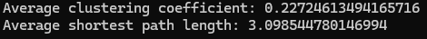

# A simple and flexible algorithm to generate real-world networks

## This repository contains the implementation of an algorithm designed to generate undirected graphs with three key characteristics often observed in real-world networks, using random walks and iteratively adding edges based on a probability distribution:
### 1) Scale-freeness: Long-tailed degree distributions where a few nodes have significantly more connections than others.
### 2) Small-world phenomenon: Short average distances between nodes.
### 3) High clustering coefficients: Nodes form tightly knit communities.

## Each random walk marks a number of nodes given as a parameter to the algorithm, creates a new node on the network, and creates edges linking all of the marked nodes to the new node. The process is repeated until the network has the wished amount of edges.

## How to use
### Import the 'generate_network' function from the 'network_generation.py' file and call it with the desired parameters, which are:

### - "number_of_nodes": Number of nodes that the resulting network will have.

### - "probability_step_length_one": The probability that the number steps taken between two marked nodes in the random walk will be one. This parameter increases the clustering coefficient, since if two neighbours are marked (length of step = 1) and connected to the new node, a triplet is formed.

### - "n_marked": Number of nodes marked in each random walk. Can also be seen as the number of edges added at each walk.

### Example:
```
import network_generation as ng
import networkx as nx

network = ng.generate_network(number_of_nodes=1000, probability_step_length_one=0.5, n_marked=5)

print('Average clustering coefficient:', nx.average_clustering(network))
print('Average shortest path length:', nx.average_shortest_path_length(network))
```

